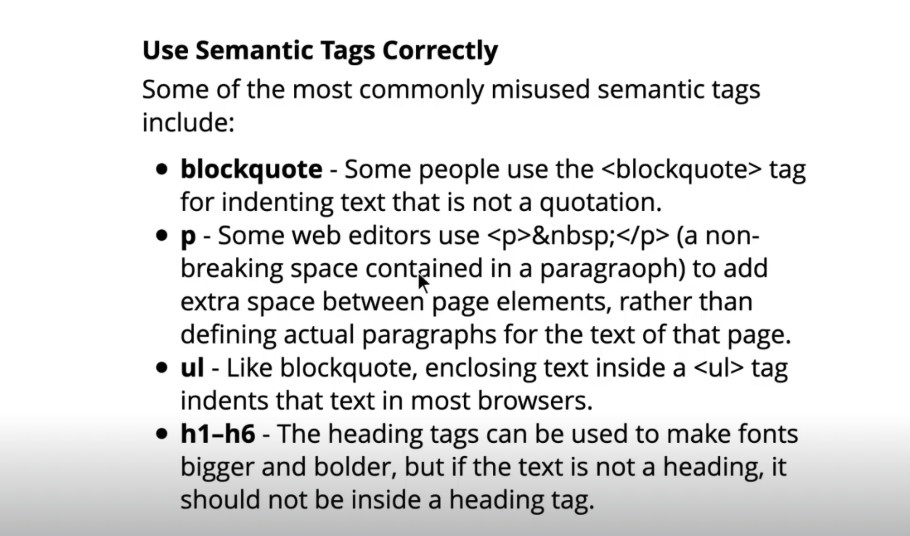
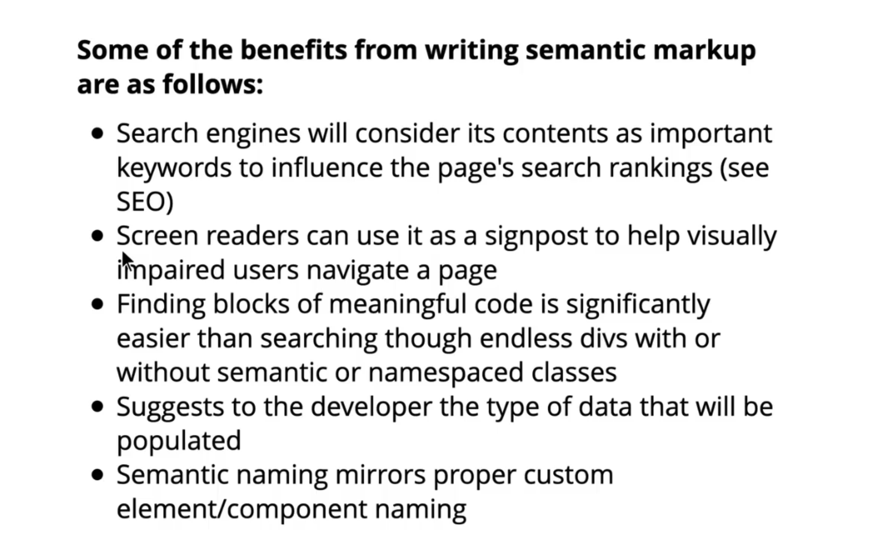

# HTML
- What is HTML?
    -  Stands for `Hyper text markup language`. tells the broser how to display the content.
    - It is a `markup language`.
    - #### `markup language : ` 
        - It is a computer language that is used to annotate text to provide information about its structure and formatting.
        - Typically composed of `Markup-Tags` and `Content`.
        - `Markup-Tag` : is used to identify the begining and end of a piece of content, and they provide information about how that content should be displayed or processed.
        - `Content` : is the text, image or other data that is being marked up.

- HTML Structure
    - 
    - 
    ``` HTML
    <html>
        <head>

        </head>
        <body>
            All visible things are in body.
            <h1>Hello World!!</h1>
        </body>
    </html>
    ```

- Elements
    - opening tag + content + closing tag = element.
    - the tags tell the information about the content.
    - eg :- `<b> Hello!! </b>`

- Tags
    - the opening and closing tags.
    - every tag has certain meaning to it.
    - eg :- `<b></b>` stands for bold.

- Attributes
    - They provide additional info about the contents of the elements.
    - 2 part : name & value. name = value
    - `<a href="abc.com"> ABC </a>`

- Semantic HTML
    - In programming, Semantics = "meaning of a piece of code".
    - eg:- `what effect does running that line of JS code have?` or `what purpose/role that HTML lement have?` (rather that what does it look like).
    - semantic HTML introduces meaning to the webpage rather that just presentation.
    - eg :- `<p>` : it indicates enclosed text is paragraph. both semantic and presentational. people know what para are and browser know how to display them.

- Why should you care about semantics?
    - impacts SEO highly.
    - It tells the browser the meaning page and its content.
    - It helps in communicating with search engines and client computers very well.
    - eg :- If suppose we create a list using CSS and Div Element --> it might get displayesd as list on page but there could be some keyboard features or something that won't come with it as in case of using an original list element.

- Use semantic tags correctly
    - 

- What’s the difference b/w `<b> and <strong>, <i> and <em>` ?
    - `<b>` : is a style.
    - `<strong>` : is a indication of how something sshould be understood.
    - `<em>` : same as `<strong>` just adding more emphasis/attention to this element.

- Some of the benefits from writing semantic markup
    - 
    
## Forms
- Forms
- `<input>`
- `<form>`
- Form controls making choices

## Input Types
- Form controls submitting forms
- Other form tags
- Other input types
- Some other tags
- HTML 5 form validation