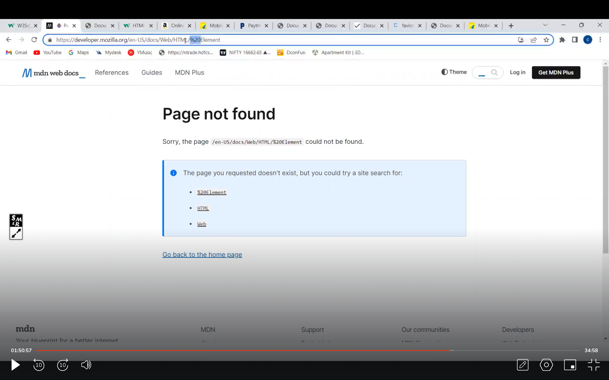

## 1. can we create our own meta-tag title like "og-title : ... " ??
- 

## 2. In below image why do we not see an default google chrome "page not found" instead a page on same "mdn" is displayed saying "page not found" ?? Also what is a fallback page ?/
- 