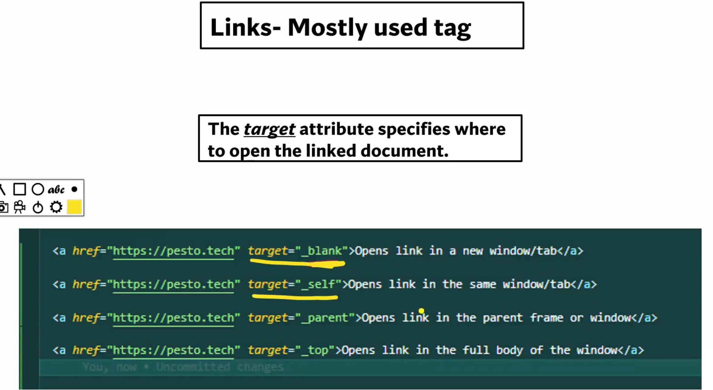
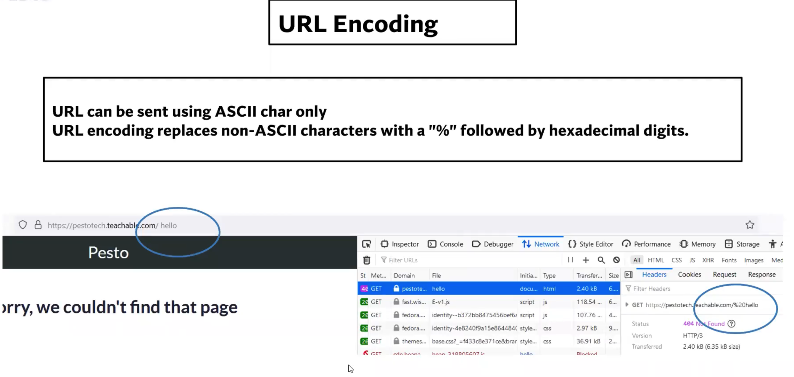
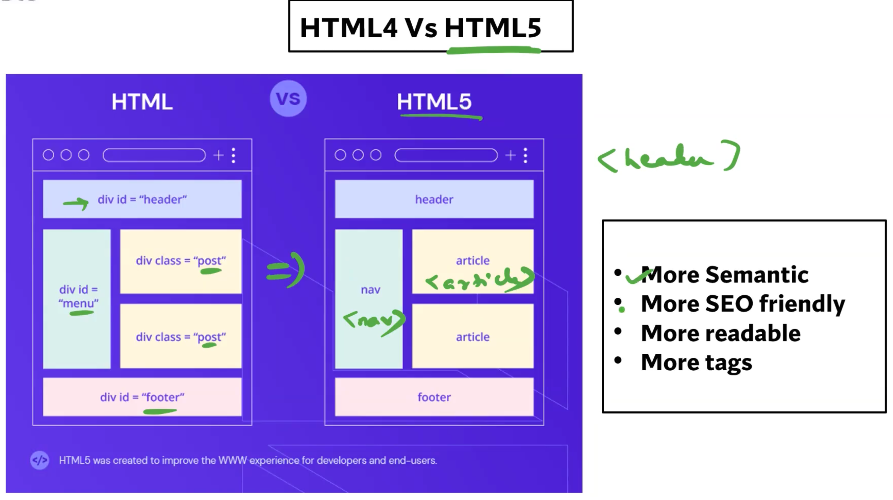

## Questions :
#### Q. If I would like to load a script that is not required at first paint, should we use Async or defer?
- `defer` : we should use defer here because it waits for the parsing of HTML and loading of JS to complete, only then it executes the JS.
 
#### Q. If we want to add a inline text with different style, which tag should be used?
- `<span></span>`

#### Q. If we want to open a URL in new tab, what should be target for anchor tag?
- `target = "_blank`

## HTML :
- Stands for `Hyper text markup language`. tells the broser how to display the content.
- It is a `markup language`.
- **`markup language : `** 
    - It is a computer language that is used to annotate text to provide information about its structure and formatting.
    - Typically composed of `Markup-Tags` and `Content`.
    - `Markup-Tag` : is used to identify the begining and end of a piece of content, and they provide information about how that content should be displayed or processed.
    - `Content` : is the text, image or other data that is being marked up.

## HTML Layout Structure :

- 
``` HTML
<html>
    <head>

    </head>
    <body>
        Hello World!
        <h1>Hello World!!</h1>
    </body>
</html>
```

## Deep dive into `<HEAD>` :
- Head is basically a container for `metadata`.

- 

- 

- List of all meta tags: https://www.metatags.org/all-meta-tags-overview/

## 3 -ways to add CSS in your webpage :
1. inline : 
    - highest priority.
    - <h1 style="color: red">Hey there!!</h1>
2. internal : 
    - second hoghest priority.
    - recommended to add in the <head></head> section of html. 
    - <style>
        color: red;
      </style>
3. external : 
    -  <link rel="stylesheet" type="text/css" href="style.css">
- Priority : `inline > internal > external`

## Javascript in html : `async vs defer`
- **NOTE : without using `async` or `defer` JS loading will not happen in parallel with HTML parsing.**
- **NOTE : Using `async` and `defer` together is not recommended, but if used together JS will give higher priority to `async`.**
1. Adding javascript in `<head>` :
    - If the script size is heavy, then load time increases when added in head. 
    - Hence not recommended for heavy scripts.
    - the loading of JS happens when the execution engine reaches that line and at that moment the parsing is paused.
    - parsing resumes when both the loading and execution of JS code is complete.
    - 

2. Adding javascript at bottom of `<body>` :
    - we add javascript at bottom of body only if we dont want the script to load at the first paint.
    - the loading of JS happens after the parsing of entire HTML is complete.
    - 

3. Using `async` :
    - It loads the JS parallel to the HTML parsing.
    - If executes the JS only when loading is completed, at that time the parsing is paused until the JS execution is finished.
    - we use `async` if our script contains some code that is necessary for our page to load at the very start.
    - eg :- if we want to load a image that comes from database at the main page of our website/app. like on amazon website the images show up the moment the js completes its loading.
    - eg :- sometimes websites like flipkat/amazon  just load a lower resolution or pixalated image at the first page load and when we spend sometime on that page the it replaces the those images with high resolution ones. in such cases as well we will make the low resolution images as `async` so that it shows up as soon as it loads and since it is of low resolution it will load very fast if loading happens parallely.
    - 

4. Using `defer` :
    - It loads the JS parallel to the HTML parsing.
    - If executes the JS only when loading and the parsing of HTML is completed or finished.
    - eg :- in amazon website we don't want the menu click event to actually load at the very beginnig but after some images have loaded so we add the `defer` keyword for such cases.
    - 

## link tag in HTML `<a href="..." target="..."> content </a>` :
- `<a target="_blank|_self|_parent|_top|framename">`
-   `Value`	    `Description`
    _blank	    Opens the linked document in a new window or tab.
    _self	    Opens the linked document in the same frame as it was clicked `(this is default)`.
    _parent	    Opens the linked document in the parent frame `(immediate parent)`.
    _top	    Opens the linked document in the full body of the window `(ie. the topmost parent)`.
    framename	Opens the linked document in the named iframe.

- 

## SEO friendly tags :
1. `<address>` :
2. `<blockquote>` :
3. `<abbr>` :
4. `<q>` :
5. `<cite>` :
6. `<bdo>` :

## Symbols and Emojis :

``` html
<!DOCTYPE html>
<html lang="en">
<head>
    <meta charset="UTF-8">
    <meta http-equiv="X-UA-Compatible" content="IE=edge">
    <meta name="viewport" content="width=device-width, initial-scale=1.0">
    <title>My Website</title>
</head>
<body>
    <h1>My First Emoji</h1>
    <p>Happy face emoji is : &#128512; </p>
</body>
</html>
```

## URL encoding  :
- in below image we can see no-ascii char `" "` has been replaced by `"%20"` ascii value.
- 

## XHTML :
- Html displays content even if it has errors.
- XHTML is more stricter and formatted.
- Use cases of HTML : Compliant web applications.
- Use case of XHTML : Legacy & Error-prone applications like financing systems.

| HTML | XHTML |
|---|---|
| Tags aren't extensible | Tags are extensible  |
| Tags are not case sensitive. | Only lowercase tags are allowed  | 
| Possible to leave off any ending tag like `</body>`  | Tags must appear in pairs  |
| Overlapping tags | No overlapping tags |

## HTML-4 vs HTML-5 :
- 
