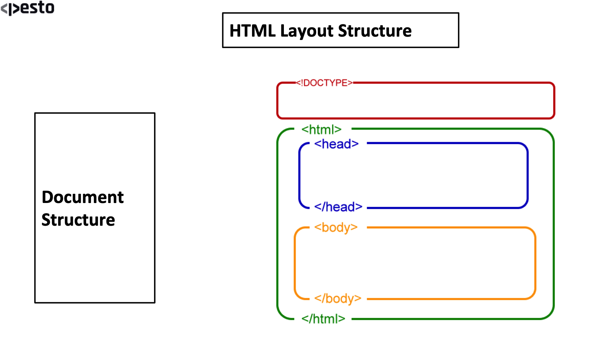
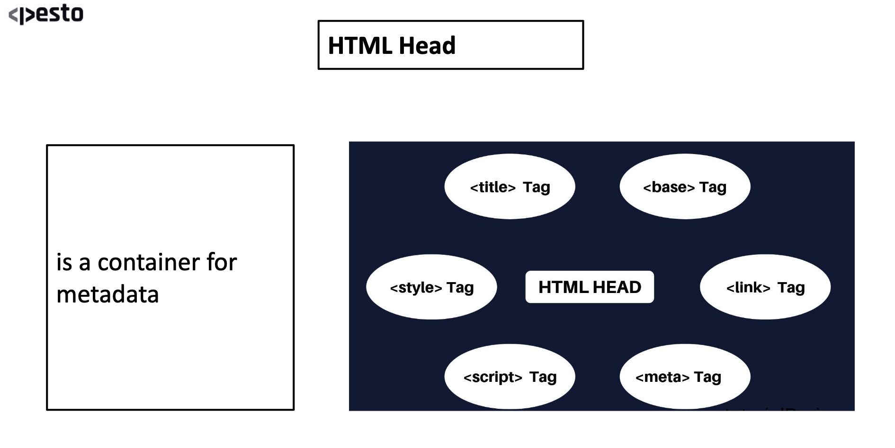
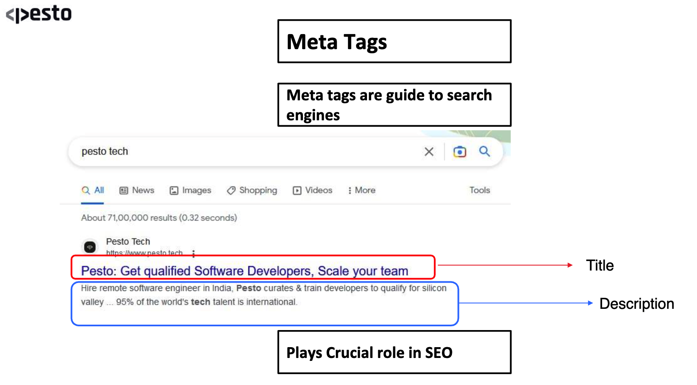

## HTML
- Stands for `Hyper text markup language`. tells the broser how to display the content.
- It is a `markup language`.
- **`markup language : `** 
    - It is a computer language that is used to annotate text to provide information about its structure and formatting.
    - Typically composed of `Markup-Tags` and `Content`.
    - `Markup-Tag` : is used to identify the begining and end of a piece of content, and they provide information about how that content should be displayed or processed.
    - `Content` : is the text, image or other data that is being marked up.

## HTML Layout Structure

- 
``` HTML
<html>
    <head>

    </head>
    <body>
        Hello World!
        <h1>Hello World!!</h1>
    </body>
</html>
```

## Deep dive into `<HEAD>`
- Head is basically a container for `metadata`.

- 

- 

- List of all meta tags: https://www.metatags.org/all-meta-tags-overview/

## Elements and Tags

## Tables, URL encoding & HTML5

## Deploy to GitHub Pages