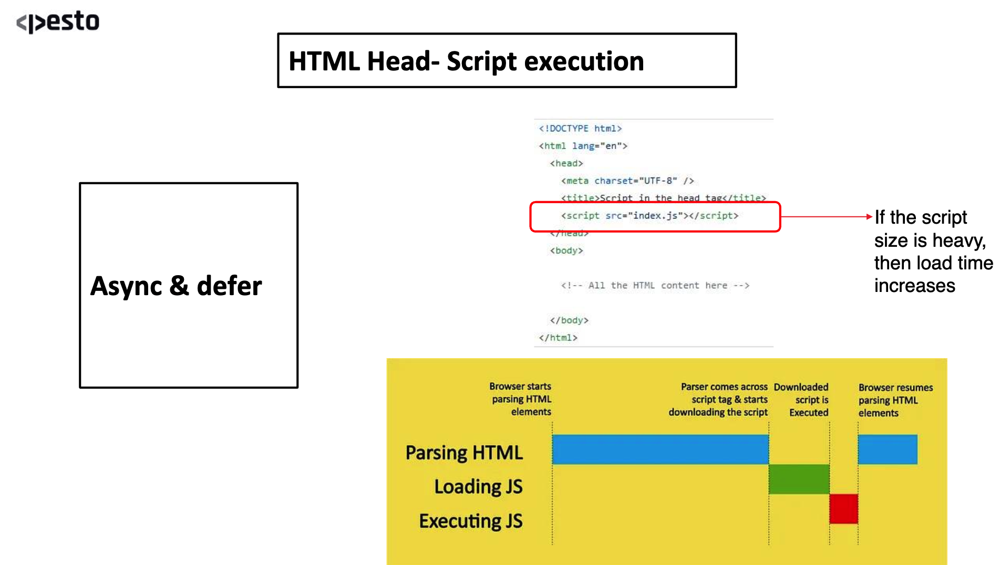
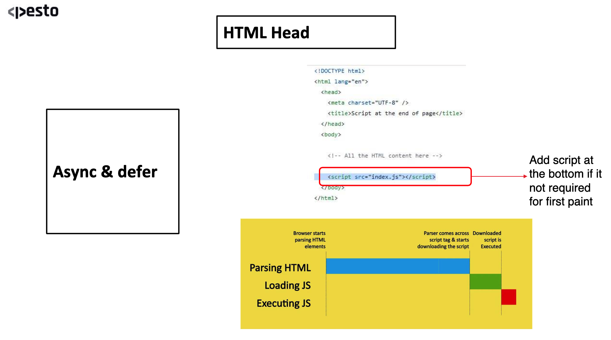
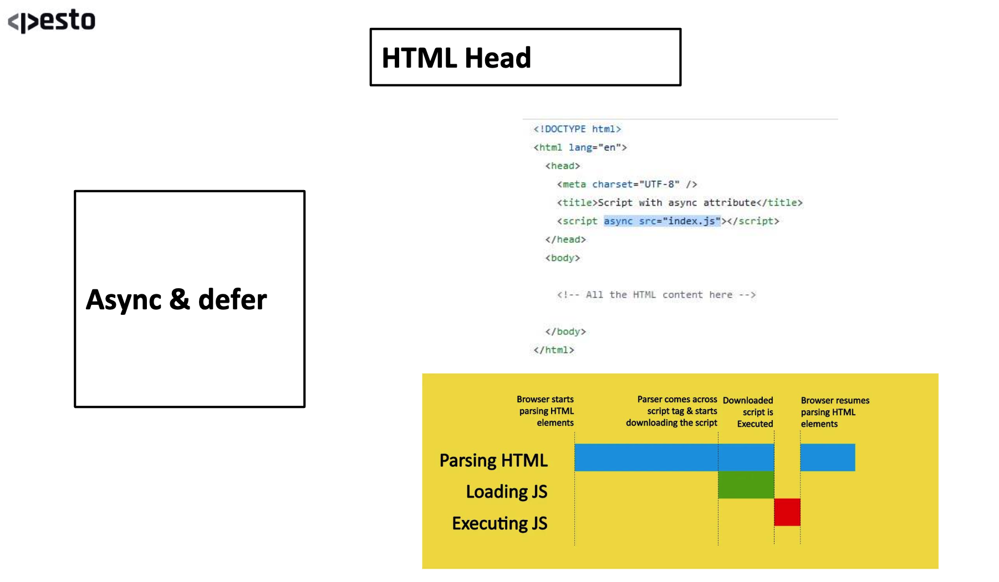
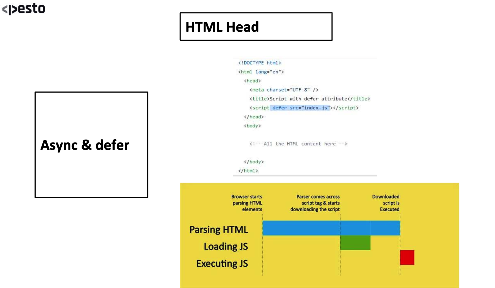

## HTML :
- Stands for `Hyper text markup language`. tells the broser how to display the content.
- It is a `markup language`.
- **`markup language : `** 
    - It is a computer language that is used to annotate text to provide information about its structure and formatting.
    - Typically composed of `Markup-Tags` and `Content`.
    - `Markup-Tag` : is used to identify the begining and end of a piece of content, and they provide information about how that content should be displayed or processed.
    - `Content` : is the text, image or other data that is being marked up.

## HTML Layout Structure :

- 
``` HTML
<html>
    <head>

    </head>
    <body>
        Hello World!
        <h1>Hello World!!</h1>
    </body>
</html>
```

## Deep dive into `<HEAD>` :
- Head is basically a container for `metadata`.

- 

- 

- List of all meta tags: https://www.metatags.org/all-meta-tags-overview/

## 3 -ways to add CSS in your webpage :
1. inline : 
    - highest priority.
    - <h1 style="color: red">Hey there!!</h1>
2. internal : 
    - second hoghest priority.
    - recommended to add in the <head></head> section of html. 
    - <style>
        color: red;
      </style>
3. external : 
    -  <link rel="stylesheet" type="text/css" href="style.css">
- Priority : `inline > internal > external`

## Javascript in html :
- NOTE : without using `async` or `defer` JS loading will not happen in parallel with HTML parsing.
1. Adding javascript in `<head>` :
    - If the script size is heavy, then load time increases when added in head. hence not recommended.
    - 

2. Adding javascript at bottom of `<body>` :
    - we add javascript at bottom of body only if we dont want the script to load at the first paint.
    - 

3. Using `async` :
    - It loads the JS parallel to the HTML parsing.
    - If executes the JS only when loading is completed, at that time the parsing is paused until the JS execution is finished.
    - we use `async` if our script contains some code that is necessary for our page to load at the very start.
    - eg :- if we want to load a image that comes from database at the main page of our website/app. like on amazon website the images show up the moment the js completes its loading.
    - 

4. Using `defer` :
    - It loads the JS parallel to the HTML parsing.
    - If executes the JS only when loading and the parsing of HTML is completed or finished.
    - 

#### Q. If I would like to load a script that is not required at first paint, should we use Async or defer?
- `defer` : we should use defer here because it waits for the parsing of HTML and loading of JS to complete, only then it executes the JS.
 

## Elements and Tags

## Tables, URL encoding & HTML5

## Deploy to GitHub Pages